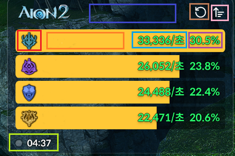
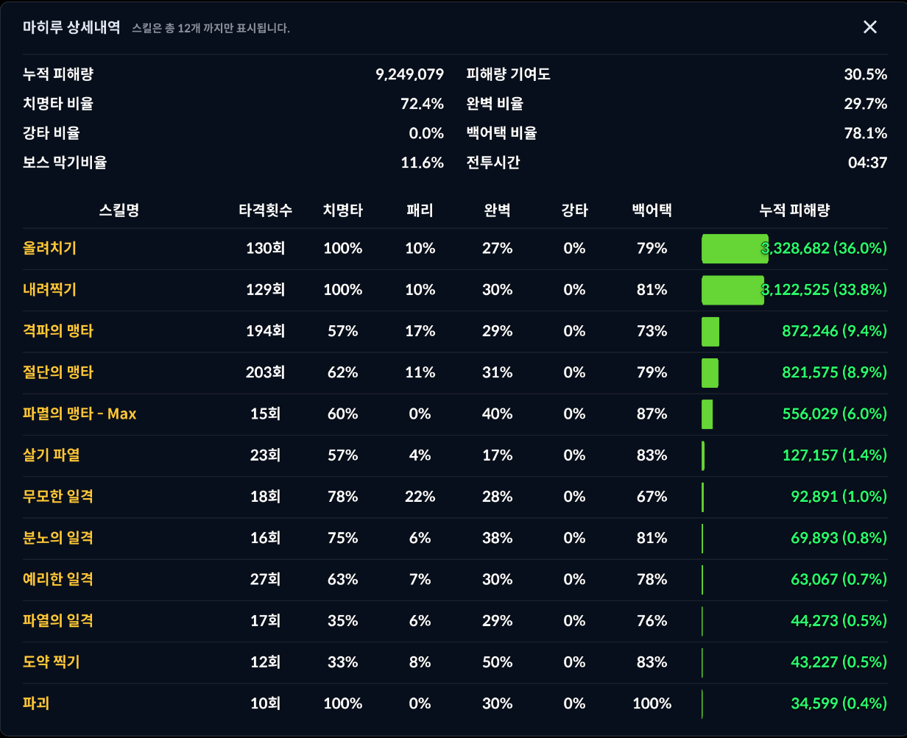

# AION2Meter4J

아이온2 전투분석을 위한 미터기 프로젝트

[](LICENSE)
[](https://github.com/TK-open-public/Aion2-Dps-Meter/issues)
[](https://github.com/TK-open-public/Aion2-Dps-Meter/pulls)

해당 프로젝트는 운영측의 요청, 패킷암호화등의 조치, 공식적인 사용중단 언급이 있다면 중지 및 비공개상태로 전환됩니다.

## Table of Contents

- [빌드하기](#빌드하기)
- [사용법](#사용법)
- [UI설명](#ui-설명)
- [FAQ](#FAQ)
- [다운로드](#다운로드)

## 빌드하기

```bash
# 레포지토리 복사
git clone https://github.com/TK-open-public/Aion2-Dps-Meter.git

# 디렉토리 이동
cd Aion2-Dps-Meter

# msi 빌드
./gradlew packageDistributionForCurrentOS
```

## 사용법

### 위 빌드하기는 일반 사용자와는 무관합니다.

1. npcap (https://npcap.com/#download) 를 설치합니다. (Install Npcap in WinPcap API-compatible Mode 필수 체크)
2. [이동](https://github.com/TK-open-public/Aion2-Dps-Meter/releases) 해당 링크에서 aion2meter4j-0.2.0.msi을 다운받아 설치합니다.
3. **아이온이 켜져있는 상태라면 먼저 캐릭터 선택창으로 이동합니다**.
4. 프로그램이 설치된 위치 (기본 설치 경로 C:\Program Files\aion2meter4j)의 aion2meter4j.exe 를 **반드시 관리자 권한으로 실행합니다.**


5. 위의 UI가 출력된다면 성공적으로 실행되었습니다.
6. 만약 미터기가 그려지지 않는다면, 키벨리스크나 아지트로 이동하면서 테스트를 해보거나(던전 내부에서 키벨리스크 이동 포함) 3번과 4번을 반복합니다.
7. 잘 동작하다가 어느 순간 동작 하지 않는 경우 위 6번과 동일하게 키벨리스크나 던전 진입 등을 통해 이동한다면 높은 확률로 데이터를 다시 받아옵니다. 그래도 동작하지 않는다면 3번부터 다시 진행하세요.

## UI 설명

<br />



<br />

파란색 박스 - 몬스터의 이름이 출력되는 위치입니다 (예정)

갈색 박스 - 현재 기록을 초기화 합니다. 각 보스가 끝난 이후 다음 보스와 전투를 돌입하기 전 초기화가 필요합니다.

분홍색 박스 - DPS를 펼치거나 접습니다. 미터기를 보고싶지 않을때 유용합니다.

빨간색 박스 - 해당 플레이어의 직업 추론 성공시 직업 아이콘이 출력되는 위치입니다.

주황색 박스 - 플레이어의 닉네임이 출력되는 위치입니다. 클릭시 전투 상세보기 창이 열립니다.

하늘색 박스 - 현재 산정중인 몹을 기준으로 DPS가 출력되는 위치입니다.

보라색 박스 - 현재 산정중인 몹을 기준으로 기여도가 백분율로 출력됩니다.

<br />



<br />

## FAQ

- UI는 뜨는데 본인 또는 다른사람의 데미지가 하나도 출력되지 않아요.
  - npcap이 제대로 설치되었는지 확인해보세요
  - 미터기를 완전히 종료하고, 캐릭터 선택창에서 실행된것을 확인하고 월드에 접속해보세요

- 허수아비를 치고있는데 제 dps 말고 제 옆사람 dps만 떠요
  - 현재 수집되는 데미지에서 가장 많은 데미지를 입은 몬스터를 기준으로 DPS를 표시합니다. 같은 허수아비를 치거나,레기온 허수아비 혹은 사나운 암굴 입구앞의 허수아비를 이용하세요

<!-- - 같은 허수아비치는데 치는 사람 이름이 다 안떠요
  - 미터기가 캐릭터명 수집에 실패한 상태입니다. 캐릭터 선택창에서 미터기를 다시 실행해보세요
  - 닉네임이 영어 한글자라면 표기가 안될수있습니다. -->

- 미터기엔 혼자 뜨는데 기여도가 100%가 아니에요
  - 미터기가 캐릭터명 수집에 실패하여 뜨지않고있는 기여자가 있을수있습니다.


- 지속피해가 누락되는것같아요
  - 누락되는게 맞습니다. 추후 수정예정이나 작업우선도는 낮습니다.

- 커맨드 기능이 있나요?
  - 현재 커맨드 기능은 지원하지 않습니다. 추후 지원을 할 수도 있으나 작업우선도는 낮습니다.

- 전투 상세보기에서 명중 횟수가 내가 스킬을 사용한 횟수보다 많이 나와요
  - 명중 횟수는 정말 말 그대로 명중 횟수입니다. 만약 한번 스킬을 시전했을 경우 3번을 타격하는 스킬이라면, 스킬을 한번 시전했더라도 명중횟수는 3회가 됩니다

- 스킬명이 이상한 숫자로 나와요
  - 보통은 신석입니다. 만약 신석이 아닌 스킬으로 보이는 데이터의 스킬명이 숫자로 나온다면 이슈에 남겨주세요

## 다운로드

### [이동](https://github.com/TK-open-public/Aion2-Dps-Meter/releases)

딜을 잘 못넣는 유저가 있더라도 불평하지마시고 그럴수도있지 라는 마음으로 넘어가주세요

해당 프로그램을 사용함으로써 생기는 책임은 사용자 본인에게 있습니다.
