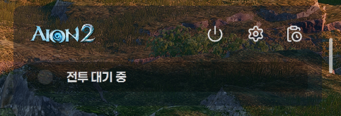
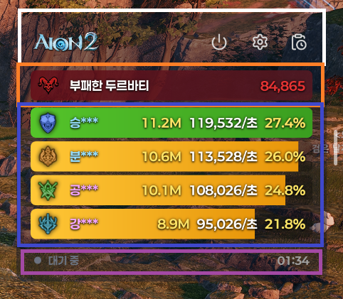
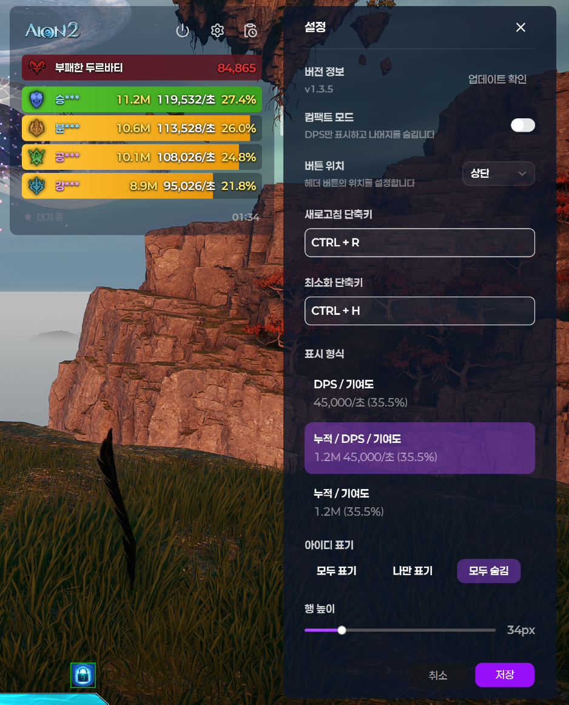
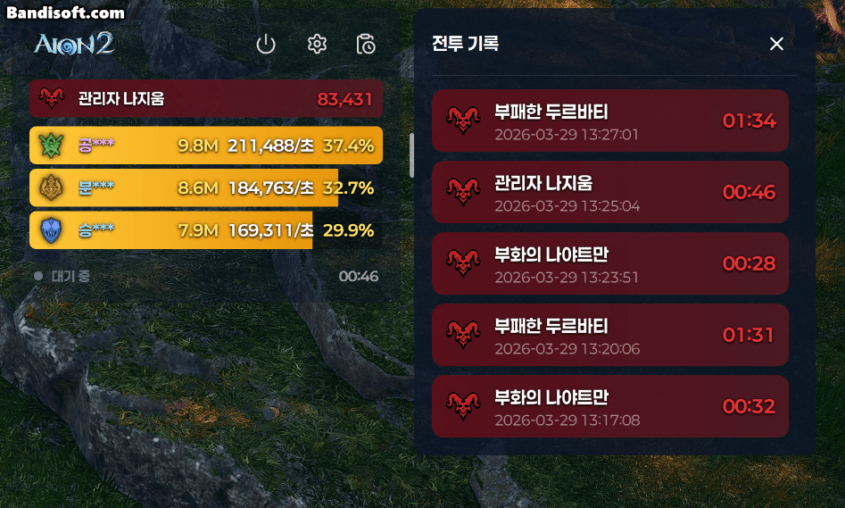
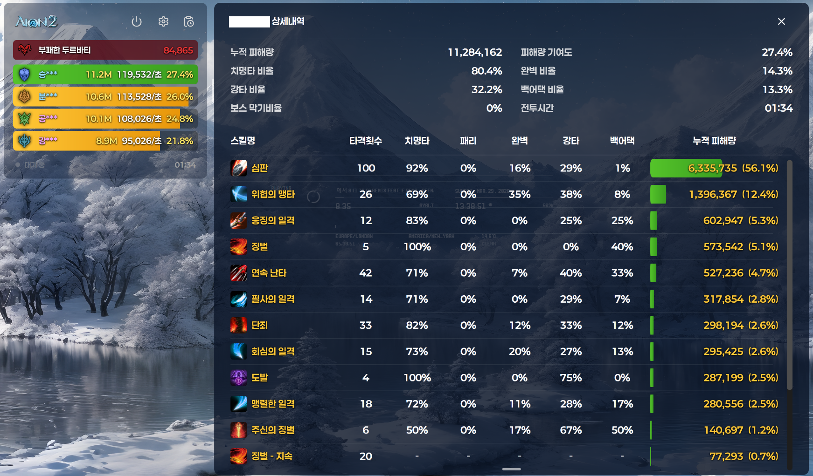
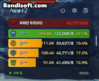

# AION2Meter4J

아이온2 전투분석을 위한 미터기 프로젝트

[](LICENSE)
[](https://github.com/TK-open-public/Aion2-Dps-Meter/issues)
[](https://github.com/TK-open-public/Aion2-Dps-Meter/pulls)

해당 프로젝트는 운영측의 요청, 패킷암호화등의 조치, 공식적인 사용중단 언급이 있다면 중지 및 비공개상태로 전환됩니다.


## Table of Contents

- [빌드하기](#빌드하기)
- [사용법](#사용법)
- [UI설명](#ui-설명)
- [FAQ](#FAQ)
- [다운로드](#다운로드)


## 빌드하기

### 해당 빌드하기는 일반 사용자와는 무관합니다.

```bash
# 레포지토리 복사
git clone https://github.com/TK-open-public/Aion2-Dps-Meter.git

# 디렉토리 이동
cd Aion2-Dps-Meter

# msi 빌드
./gradlew packageDistributionForCurrentOS
```

## 사용법


1. npcap (https://npcap.com/#download) 를 설치합니다. (Install Npcap in WinPcap API-compatible Mode 필수 체크)

2. [이동](https://github.com/TK-open-public/Aion2-Dps-Meter/releases) 해당 링크에서 aion2meter4j-x.x.x.msi을 다운받아 설치합니다.

3. **아이온이 켜져있는 상태라면 먼저 캐릭터 선택창으로 이동합니다**.

4. 프로그램이 설치된 위치 (기본 설치 경로 C:\Program Files\aion2meter4j) 또는 시작 창의 바로가기에 aion2meter4j.exe 를 **반드시 관리자 권한으로 실행합니다.**



5. 위의 UI가 출력된다면 성공적으로 실행되었습니다.

6. 만약 에러가 발생하며 실행되지 않는다면, 관리자 권한으로 실행 되었는지 확인합니다.


## UI 설명

<br />



<br />

흰 박스 - 해당 프로그램의 헤더 부분입니다. 순서대로 종료, 설정창, 전투 기록 버튼 입니다.

주황색 박스 - 보스의 이름과 남은 체력이 표시됩니다.

파란색 박스 - 유저의 DPS 집계를 하는 곳 입니다. 초록색의 경우 본인입니다.

보라색 박스 - 전투 타이머가 표시되는 곳 입니다. 전투 중 회색 Dot이 초록색으로 변경됩니다.


<br />



헤더에서 설정 버튼을 눌렀을 경우 해당 패널이 열립니다.

해당 설정은 저장됩니다.

<br />




헤더에서 전투 기록 버튼을 눌렀을 경우 해당 패널이 열립니다.

저장은 20개까지 되며, 이전 전투 기록을 조회할 수 있습니다.

<br />




<br />

미터기 부분에서 유저를 클릭했을 경우 해당 유저의 자세한 기록을 조회할 수 있습니다.

<br />
지속 피해는 치명타, 완벽 등이 발생하지 않기 때문에 
해당 패널 상단의 치명타, 완벽, 강타, 백어택, 막기 비율은 지속 피해의 타격 횟수를 제외하고 계산합니다. 
<br />
타격 횟수는 시전 횟수가 아닌, 명중 횟수 입니다.
스킬을 1회 시전을 했을 때 3회 타격을 하는 스킬이라면, 명중 횟수는 3회가 표기됩니다.

<br />


### 실제 전투를 시작했을 때 그려지는 모습


<br />

### 컴팩트 모드 + 버튼 위치 하단을 설정 했을 경우


## FAQ


- Java Failed...로 시작하는 에러가 나와요
  - 관리자 권한으로 실행하세요.
  
- DPS 창에 5명 - 6명 등 파티에 없는 사람의 내역이 나와요.
  - 위 사진을 기준으로 25202 51999가 소환 패킷을 못찾아서 생기던 누락량인데 그 값을 표시한 것이기에 같은 직업에 더하면 됩니다.
  - 모든 누락이 해결 된 것은 아니지만, 정령성이나 마도성처럼 소환수를 많이 사용하는 직업군은 조금 더 정확성이 높아졌습니다.   

- 치유성 등의 힐 스킬이 DPS에 포함되는거 같아요.
  - 힐량이 딜량안에 들어가는건 아니며, 보스치는 순간의 시간부터 집계가 시작됩니다. 정확하게는 보스를 친 딜량이 파티원을 회복시킨 수치보다 높으면 해당하는 몬스터의 DPS가 UI에 표기되기 시작합니다. 힐이 딜량에 집계되지는 않습니다.

- UI는 보이는데 본인 또는 다른사람의 데미지가 하나도 출력되지 않아요.
  - npcap이 제대로 설치되었는지 확인해보세요
  - 미터기를 완전히 종료하고, 캐릭터 선택창에서 실행된것을 확인하고 월드에 접속해보세요

<!-- - 허수아비를 치고있는데 제 dps 말고 제 옆사람 dps만 떠요
  - 현재 수집되는 데미지에서 가장 많은 데미지를 입은 몬스터를 기준으로 DPS를 표시합니다. 같은 허수아비를 치거나,레기온 허수아비 혹은 사나운 암굴 입구앞의 허수아비를 이용하세요 -->

<!-- - 같은 허수아비치는데 치는 사람 이름이 다 안떠요
  - 미터기가 캐릭터명 수집에 실패한 상태입니다. 캐릭터 선택창에서 미터기를 다시 실행해보세요
  - 닉네임이 영어 한글자라면 표기가 안될수있습니다. -->
<!-- 
- 미터기엔 혼자 뜨는데 기여도가 100%가 아니에요
  - 미터기가 캐릭터명 수집에 실패하여 뜨지않고있는 기여자가 있을수있습니다. -->

<!-- - 커맨드 기능이 있나요?
  - 현재 커맨드 기능을 지원합니다. -->

- 전투 상세보기에서 타격 횟수가 내가 스킬을 사용한 횟수보다 많이 나와요
  - 타격 횟수는 말 그대로 타격 횟수입니다. 만약 한번 스킬을 시전했을 경우 3번을 타격하는 스킬이라면, 스킬을 한번 시전했더라도 명중횟수는 3회가 됩니다

- 스킬명이 이상한 숫자로 나와요
  - 보통은 신석입니다. 만약 신석이 아닌 스킬으로 보이는 데이터의 스킬명이 숫자로 나온다면 이슈에 남겨주세요

## 다운로드

### [이동](https://github.com/TK-open-public/Aion2-Dps-Meter/releases)

딜을 잘 못넣는 유저가 있더라도 불평하지마시고 그럴수도있지 라는 마음으로 넘어가주세요

해당 프로그램을 사용함으로써 생기는 책임은 사용자 본인에게 있습니다.
